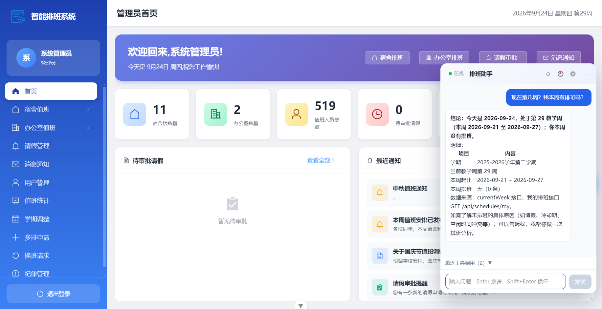
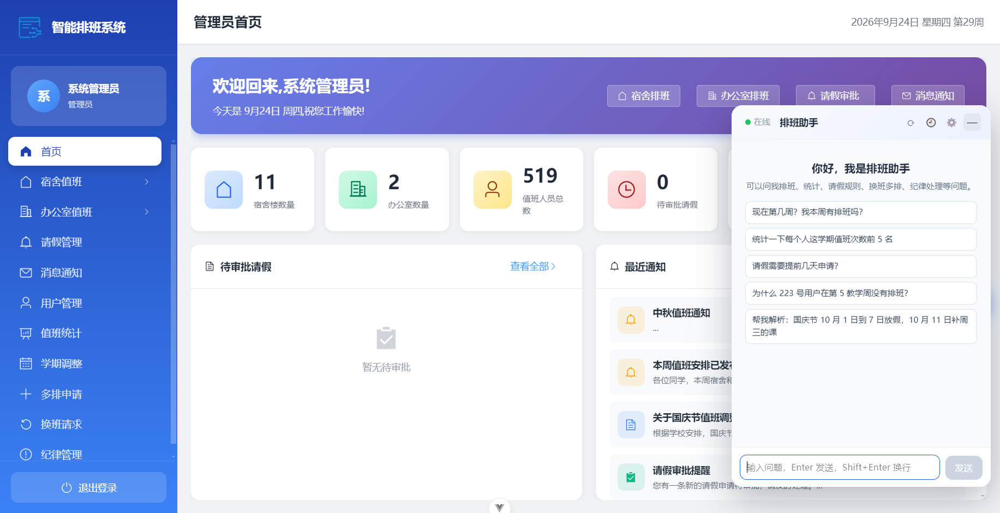
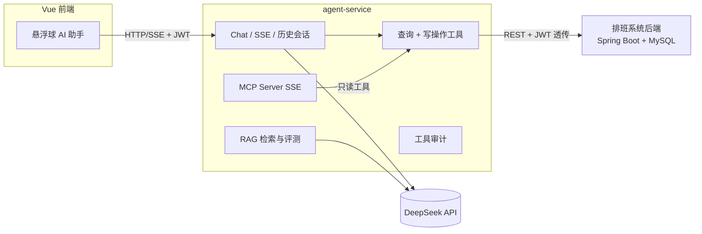

# 智能排班系统 · Agent 升级版

面向高校党群组织「宿舍值班 + 办公室值班」双场景的智能排班系统，并在其基础上完成了 **AI Agent 化升级**：
独立 Agent 服务（Spring AI 工具编排 / RAG / MCP Server / 人工确认），前端内嵌**悬浮球 AI 助手**。

> 说明：排班系统为团队项目（多人协作，已在校园实际部署使用）。

## 效果预览

管理首页内嵌「排班助手」悬浮球：流式回答、Markdown 表格、工具调用可视化（示例问题：本周排班）



空状态快捷问题与面板（按系统定制）：



## 功能特性

### 排班系统
- 自研排班引擎：指针轮转 + 冷却表防连排 + 多排优先 + 人员回捞；支持单双周 / 期末周 / 节假日调休补课 / 请假冲突排除
- 23 张业务表：空闲时间矩阵、请假/换班/多排审批流、冷却表、岗位身份权限矩阵、纪律考核
- Excel 异步导入（分片事务 / 查重 / 床位与岗位冲突校验）与 4 类统计导出
- JWT + 角色路径鉴权；管理员 / 普通用户双端界面（Vue 3 + Element Plus）

### AI Agent 升级（agent-service）
- **工具编排**：Spring AI `ChatClient` + `@Tool`，19 个查询工具 + 40 个写操作工具（请假/换班/多排审批、排班生成与手工调班、消息、用户、空闲时间等）
- **写操作人工确认（HITL）**：写工具仅在界面确认（`allowWrites=true`）后挂载；破坏性操作要求模型先复述影响再二次确认
- **数据权限**：工具实例绑定调用者 JWT 并透传业务接口，权限由业务系统强制，模型无法绕过
- **RAG 制度问答**：4 篇制度文档 → 分块 → 向量检索 → 可选 `bge-reranker` 重排 → 回答带出处；自建 50 题评测集（本地向量 hit@1 82% / hit@3 98%）
- **结构化输出**：自然语言节假日/调休 → 结构化草稿 + 校验警告 → 管理员确认落库
- **MCP Server（SSE）**：暴露只读工具，供桌面端 Agent（DeepSeekBall）等 MCP 客户端跨系统调用
- **历史会话**：会话与消息 JSON 原子落盘，服务重启不丢上下文；按登录用户隔离，支持回看/删除
- **可观测**：工具调用审计（工具名/参数/耗时/成败）、RAG 评测接口

### 前端悬浮球助手
- 零依赖 Vue 单文件组件，内嵌进系统原有页面（不改变原有布局）
- 流式输出（SSE 分片 JSON 转义，Markdown 表格/换行不丢失）、多轮上下文、一键新会话
- 历史会话抽屉（标题/时间/条数，点击继续、删除）
- 工具调用可视化（最近调用成败与耗时）；写操作完成后**自动刷新当前页面数据**

## 架构



> 更完整的架构与关键链路（工具编排 / RAG / HITL / MCP / 审计）见 [docs/ARCHITECTURE.md](docs/ARCHITECTURE.md)。

## 目录结构

```
.
├─ front/           # Vue 3 前端（含悬浮球助手组件 src/components/AgentBall.vue）
├─ server/          # Spring Boot 排班系统后端
├─ agent-service/   # 独立 Agent 服务（Spring AI + MCP Server + RAG）
├─ docs/            # 架构说明与界面截图
└─ README.md
```

## 快速开始

**前置要求**：Node.js 18+、Java 17+、Maven 3.9+（Windows 也可直接用 `server/mvnw.cmd`）、MySQL 8。

### 1. 数据库
```bash
mysql -u root -p < server/src/main/resources/sql/init_schema.sql
mysql -u root -p < server/src/main/resources/sql/init_data.sql
```

### 2. 排班后端（默认 8080）
```bash
cd server
mvn spring-boot:run
# 数据库连接通过环境变量覆盖：DB_PASSWORD、JWT_SECRET 等（见 application.yml）
```

### 3. 前端（默认 5173/5174）
```bash
cd front
npm install
npm run dev
```

### 4. Agent 服务（默认 8090）
```bash
cd agent-service
# 必填：DEEPSEEK_API_KEY；可选：SILICONFLOW_API_KEY（RAG 使用 BGE-M3，缺省用本地向量兜底）
# 完整环境变量清单见 agent-service/.env.example（复制后填入密钥即可）
mvn spring-boot:run
```

悬浮球默认连接 `http://localhost:8090`（可在设置中修改），并自动携带当前登录 JWT。

## 测试

| 模块 | 命令 | 结果 |
|---|---|---|
| agent-service | `mvn test` | 62 个用例通过（工具 / 审计 / RAG / 会话存储 / 注册表） |
| 前端 | `npm run build` | 类型检查 + 构建通过 |

## 安全与数据说明

- 仓库内**不含任何密钥、服务器地址与真实口令**；数据库口令、JWT 密钥、模型 Key 均通过环境变量注入
- SQL 中的学生与手机号均为合成演示数据（如 `13800138001`），不对应真实人员
- 写操作默认关闭，需在界面确认后才会暴露给模型；MCP 仅暴露只读工具

## License

见 [LICENSE](LICENSE)。
