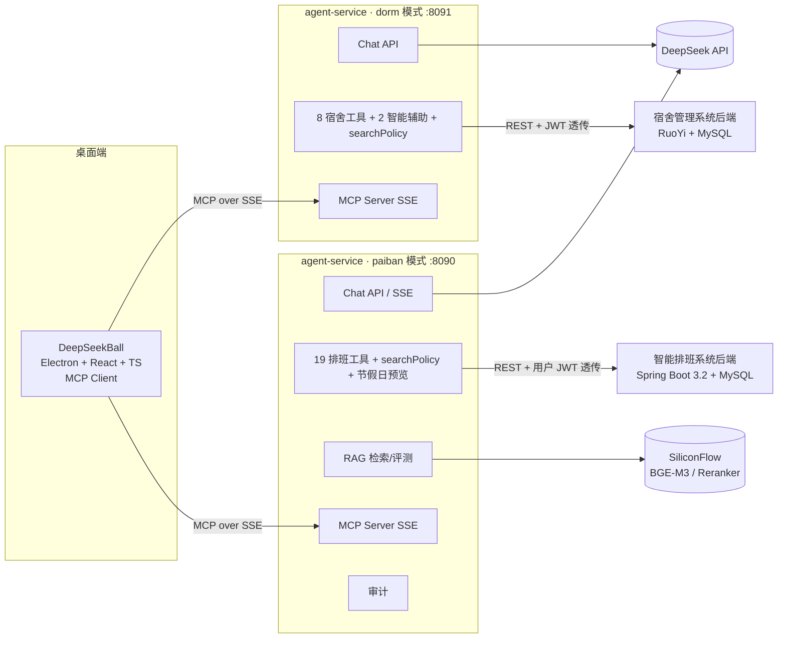
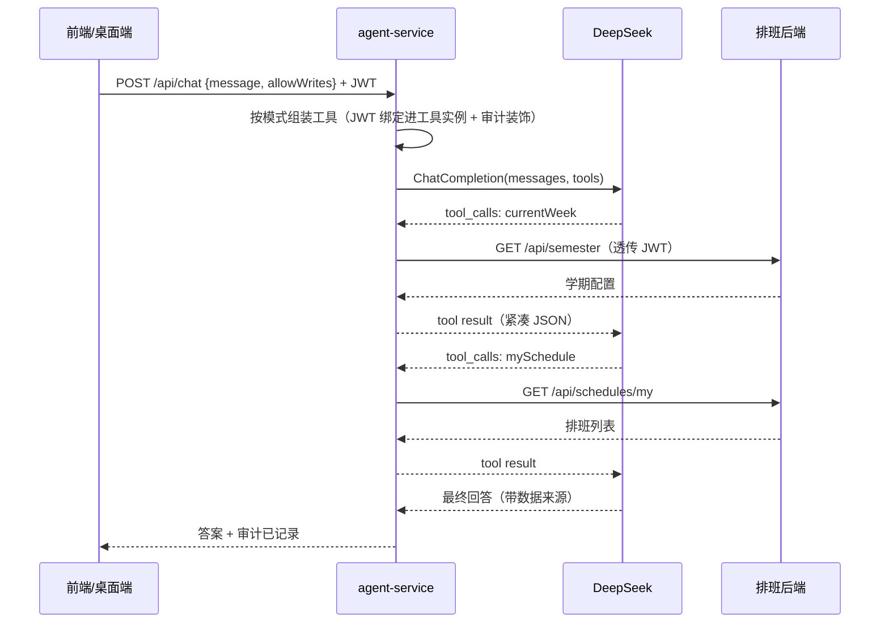
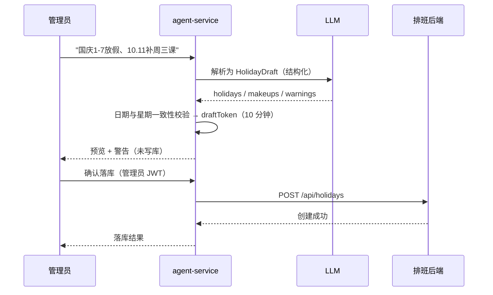
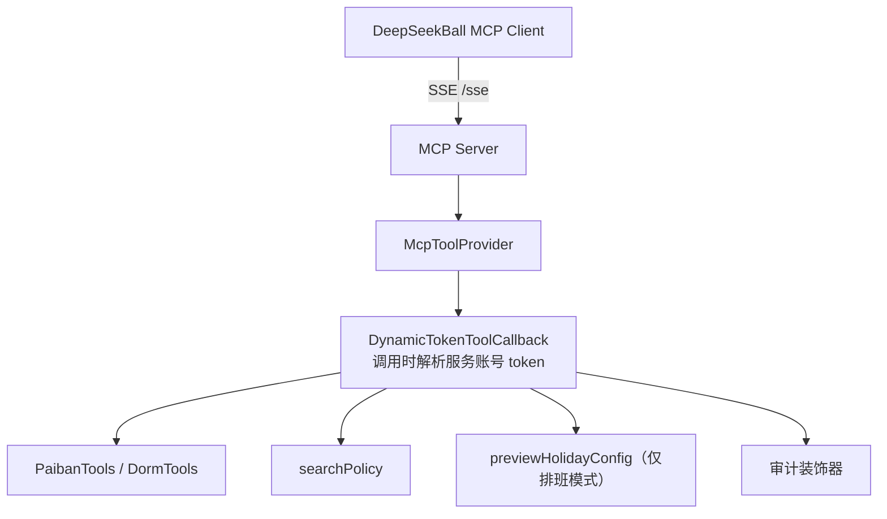

# 架构说明

## 总体架构



## 一次对话的工具编排流程（paiban 模式）



## RAG 流程

```mermaid
flowchart LR
  DOCS[制度文档 4 篇 Markdown] --> CHUNK[分块：按章节 + 目标 480 字/重叠 80]
  CHUNK --> EMB[Embedding<br/>SiliconFlow BGE-M3 或 本地哈希兜底]
  EMB --> STORE[SimpleVectorStore]
  Q[问题] --> SEARCH[向量检索 topK]
  STORE --> SEARCH
  SEARCH --> RERANK[可选：bge-reranker-v2-m3]
  RERANK --> CITED[带 source/section 的片段]
  CITED --> TOOL[searchPolicy 工具]
  EVAL[50 题评测集] --> REPORT[hit@1 / hit@3 / MRR]
```

## 结构化输出 + 人工确认（HITL）



## MCP 工具暴露（只读）



说明：
- 发送到 MCP 的工具为**只读**；写操作（`applyHolidayConfig`）只在交互式对话且 `allowWrites=true` 时挂载
- 权限边界：agent-service 不自行判定数据权限，一律透传调用者 JWT，由业务系统按角色/范围强制
